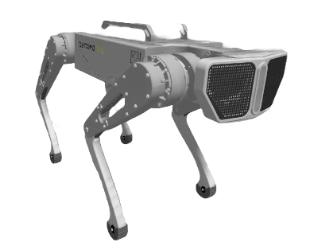

# 🤖 Dynamo One — Quadruped Robot Control System

<p align="center">
  
</p>

<p align="center">
  
  
  
  
</p>

---

## 📖 Overview

**Dynamo One** is a quadruped robot control system developed as part of a Year-5 Bachelor Thesis in **Electrical and Energy Engineering (Automation)** at the **Institute of Technology of Cambodia (ITC)**, in collaboration with **AI FARM Robotics Factory**.

The project focuses on the **simulation, modeling, and control** of a four-legged robot — ensuring stable body posture, rhythmic gait generation, and dynamic locomotion through advanced control strategies including **PID**, **P Controller**, and **Model Predictive Control (MPC)**.

> ⚠️ **Simulation Only** — This project runs entirely in a simulated environment using Gazebo Fortress and ROS2 Humble.

---

## ✨ Key Features

- 🦾 **Full 3D Robot Model** — Designed in Fusion 360, exported as `Xacro/URDF` for ROS2
- 📐 **Forward & Inverse Kinematics** — Geometric IK for all 4 legs (3-DOF per leg, 12 joints total)
- 🧠 **CPG-Based Gait Generation** — Modified Hopf oscillator for walk, trot, pace, and bound gaits
- 🎮 **PS4 Controller Interface** — Real-time joystick input for mode switching and motion command
- ⚖️ **Balance Control** — IMU-feedback P controller for roll and pitch stabilization
- 🔧 **Dual Joint Control Modes** — Joint position control and torque/effort control (PD-based)
- 📈 **MPC Dynamic Gait** — Model Predictive Control on Single Rigid Body Model (SRBM) for dynamic locomotion
- 🖥️ **3-Stage Simulation Pipeline** — PyPlot → RViz2 → Gazebo Fortress

---

## 🏗️ System Architecture

```
┌─────────────────────────────────────────────────────────────────┐
│                        User Input (PS4)                         │
│              Mode | Direction | Speed Command                   │
└────────────────────────┬────────────────────────────────────────┘
                         │
           ┌─────────────▼──────────────┐
           │     Gait Control (CPG)     │
           │  Walk | Trot | Pace | Bound│
           └─────────────┬──────────────┘
                         │
     ┌───────────────────┼────────────────────┐
     │                   │                    │
     ▼                   ▼                    ▼
Foot Trajectory    Base Motion Ref      Balance Control
  (Bézier)         (Body Pose)          (P + IMU)
     │                   │                    │
     └───────────────────┼────────────────────┘
                         │
           ┌─────────────▼──────────────┐
           │     Inverse Kinematics     │
           │   12 Joint Angles (rad)    │
           └─────────────┬──────────────┘
                         │
     ┌───────────────────┴────────────────────┐
     │                                        │
     ▼                                        ▼
Position Control                      Torque Control (PD)
/forward_position_controller      /joint_group_effort_controller
     │                                        │
     └───────────────────┬────────────────────┘
                         │
              ┌──────────▼──────────┐
              │   Gazebo Fortress   │
              │  Physics Simulation │
              └──────────┬──────────┘
                         │
              ┌──────────▼──────────┐
              │   Sensor Feedback   │
              │  IMU | Encoder | FT │
              └─────────────────────┘
```

---

## 🔄 Simulation Workflow (3 Stages)

| Stage | Environment | Purpose |
|-------|-------------|---------|
| **Stage 1** | Python + Matplotlib/PyPlot | Algorithm validation: IK, foot trajectory, MPC |
| **Stage 2** | ROS2 Humble + RViz2 | 3D visualization, TF tree, joint state verification |
| **Stage 3** | ROS2 Humble + Gazebo Fortress | Full physics simulation with gravity, friction, contact |

---

## 🦿 Robot Specifications

| Parameter | Description | Value |
|-----------|-------------|-------|
| `L` | Body Length | 0.433 m |
| `H` | Body Height | 0.050 m |
| `W` | Body Width | 0.120 m |
| `L1` | Hip Link Length | 0.087 m |
| `L2` | Thigh Link Length | 0.250 m |
| `L3` | Calf Link Length | 0.250 m |
| **DOF** | Total Joints | 12 (3 per leg) |
| **Sensors** | Onboard | IMU + Force-Torque (per foot) |

---

## 🧮 Control Strategies

### 1. Body Posture Control
- Joint position control via **Inverse Kinematics**
- Joint torque control via **PD Controller** (Kp_hip=50, Kp_thigh=60, Kp_calf=50)
- Body height tracking validated in Gazebo (target Z = 0.35 m / 0.47 m)

### 2. Balance Control (P Controller + IMU)
- Roll and pitch correction with **Kp = 0.7**
- IMU quaternion → Euler angle conversion
- Corrective rotation applied via `RotMatrix3D()` → IK → joint commands
- Pitch error reduced from −0.349 rad → ~0.0 rad

### 3. Gait Generation (CPG — Modified Hopf Oscillator)

| Gait | Phase Matrix | Duty Factor β | Period T |
|------|-------------|---------------|----------|
| Walk | (0, π, π/2, 3π/2) | 0.75 | 0.6–0.8 s |
| Trot | (0, π, 0, π) | 0.50 | 0.4–0.6 s |
| Pace | (0, π, π, 0) | 0.45–0.50 | 0.4–0.6 s |
| Bound | (0, 0, π, π) | 0.45–0.50 | 0.3–0.5 s |

Swing trajectories are generated using **5th-degree Bézier curves** (6 control points).

### 4. Dynamic Gait — MPC on SRBM
- Robot modeled as a **Single Rigid Body** (Newton-Euler equations)
- **Raibert Heuristic** for foot placement planning
- **Cubic Bézier curves** for swing trajectories
- MPC optimizes Ground Reaction Forces (GRFs) over a receding horizon N=7
- Solved as a **Quadratic Program (QP)** with friction cone constraints
- Running at **100 Hz** in PyPlot simulation

---

## 📊 Key Results

| Test | Result |
|------|--------|
| Single Leg IK | ✅ Accurate foot positioning in XZ plane |
| Body Height Control | ✅ Tracks Z = 0.47 m with encoder feedback |
| Roll/Pitch Correction | ✅ Error driven to ~0.0 rad from −0.349 rad |
| Forward Walking | ✅ Roll error ±0.01 rad, Pitch error −0.04 to 0.01 rad |
| Lateral Walking | ✅ Roll error −0.02 to 0.008 rad |
| Trotting (with P controller) | ✅ Stable oscillations; eliminates instability seen without balance control |
| MPC Bounding (Vx = 0.8 m/s) | ✅ CoM position error within 0.0–0.08 m |
| MPC Trotting (Vx = 0.4 m/s) | ✅ Consistent CoM trajectory tracking |
| MPC Pacing (Vx = 0.6 m/s) | ✅ Minimal CoM deviation from reference |

---

## 🎥 Demo Videos

| Demo | Link |
|------|------|
| Single Leg Testing | [▶ Watch](https://youtu.be/wE9hqBG-EZ4) |
| Body Control — Python Script | [▶ Watch](https://youtu.be/If6y2yiLecQ) |
| Full Gait — Python Script | [▶ Watch](https://youtu.be/2I3OJwqph_Y) |
| Body & Gait Control (Walk/Trot) in Gazebo | [▶ Watch](https://youtu.be/IAkFohrhFLc) |
| Torque Control in Gazebo | [▶ Watch](https://youtu.be/kse9WgMeIOs) |

---

## 📁 Repository Structure

```
dynamo_one/
├── dynamo_one_description/         # Robot URDF/Xacro model
│   ├── xacro/
│   │   ├── robot.xacro             # Main robot description
│   │   ├── leg.xacro               # Single leg macro
│   │   ├── const.xacro             # Physical parameters
│   │   ├── materials.xacro         # Visual materials
│   │   ├── gazebo_position.xacro   # Position control plugin
│   │   ├── gazebo_torque.xacro     # Torque control plugin
│   │   └── ros2_control.xacro      # ROS2 control interface
│   └── meshes/                     # CAD mesh files (.dae)
│
├── python_controller/              # Core control algorithms
│   ├── robot/
│   │   └── QuadrupedModel.py       # Robot kinematics model
│   ├── FootTrajectory/
│   │   └── CPG_Network.py          # CPG gait generator
│   ├── Controller/
│   │   ├── PID_controller.py       # PID/P controller
│   │   └── Base_Foothold_trajectory.py  # Raibert heuristic + MPC
│   └── MPC/
│       └── srbm_mpc.py             # MPC on Single Rigid Body Model
│
├── dynamo_one_control/             # ROS2 control nodes
│   ├── PS4_controller.py           # PS4 joystick input node
│   ├── dynamo_one_control.py       # Gait & body control node
│   └── balance_controller.py       # IMU-based balance node
│
├── launch/                         # Launch files
│   ├── gazebo.launch.py            # Full Gazebo simulation
│   ├── rviz2.launch.py             # RViz2 visualization
│   └── position_control.launch.py
│
├── config/                         # Configuration files
│   └── controllers.yaml
│
├── scripts/                        # Standalone Python scripts
│   └── mpc_pyplot_simulation.py    # MPC visualization in PyPlot
│
└── docs/                           # Documentation & thesis
```

---

## 🛠️ Prerequisites

| Dependency | Version |
|------------|---------|
| Ubuntu | 22.04 LTS |
| ROS2 | Humble Hawksbill |
| Gazebo | Fortress |
| Python | 3.10+ |
| `numpy` | latest |
| `scipy` | latest |
| `matplotlib` | latest |
| `osqp` | latest (QP solver for MPC) |

---

## ⚙️ Installation

### 1. Clone the Repository

```bash
mkdir -p ~/Dynamo_one_ws/src
cd ~/Dynamo_one_ws/src
git clone https://github.com/boyloy21/Quadruped-Robot-Dynamo-one.git
```

### 2. Install Python Dependencies

```bash
pip install numpy scipy matplotlib osqp
```

### 3. Install ROS2 Dependencies

```bash
cd ~/Dynamo_one_ws
rosdep install --from-paths src --ignore-src -r -y
```

### 4. Build the Workspace

```bash
cd ~/Dynamo_one_ws
colcon build --symlink-install
source install/setup.bash
```

---

## 🚀 Running the Simulation

### Stage 1 — PyPlot Algorithm Validation

```bash
# Test single leg IK
python3 scripts/single_leg_test.py

# Test MPC with SRBM (bounding gait)
python3 scripts/mpc_pyplot_simulation.py
```

### Stage 2 — RViz2 Visualization

```bash
# Terminal 1: Launch robot state publisher
ros2 launch dynamo_one_description rviz_control.launch.py

# Terminal 2: Run gait controller
ros2 run dynamo_one_control dynamo_one_controlrviz.launch.py
```

### Stage 3 — Full Gazebo Simulation

```bash
# Terminal 1: Launch Gazebo with position control
ros2 launch dynamo_one_description gazebo_position.launch.py 

# Terminal 2: Run main gait & body controller
ros2 run dynamo_one_control dynamo_one_controlV2.launch.py
```

### Torque Control Mode

```bash
# Terminal 1: Launch Gazebo with torque (effort) control
ros2 launch dynamo_one_description gazebo_torque.launch.py

# Terminal 2: Run main gait & body controller
ros2 run dynamo_one_control body_control.launch.py
```

---

## 🎮 PS4 Controller Mapping

| Button / Axis | Function |
|---------------|----------|
| ✖ (Cross) | Stand mode |
| ○ (Circle) | Sit mode |
| □ (Square) | Walk mode |
| △ (Triangle) | Trot mode |
| L1 | Increase speed |
| L2 | Decrease speed |
| Left Stick (↑↓) | Forward / Backward |
| Left Stick (←→) | Left / Right |
| Right Stick (←→) | Yaw rotation |
| D-Pad (↑↓) | Pitch body |
| D-Pad (←→) | Roll body |
| R2 Trigger | Body height control |

---

## 📚 References

1. Y. Xu et al., "A bio-inspired control strategy for locomotion of a quadruped robot," *Applied Sciences*, vol. 8, no. 1, 2018.
2. V. Danilov and S. A. K. Diane, "CPG-Based Gait Generator for a Quadruped Robot," *Lecture Notes in Networks and Systems*, vol. 530, Springer, 2023.
3. A. Shahriar, "A balanced positional control architecture for a 12-DOF quadruped robot," *arXiv:2312.06365*, 2023.
4. C. Yu et al., "Posture correction of quadruped robot for adaptive slope walking," *IEEE ROBIO*, 2018.
5. J. Li et al., "A real time planning and control framework for robust and dynamic quadrupedal locomotion," *Journal of Bionic Engineering*, vol. 20, no. 4, 2023.
6. J. Shen and D. Hong, "Convex MPC of Single Rigid Body Model on SO(3) for versatile dynamic legged motions," *IEEE ICRA*, 2022.
7. J. D. Carlo et al., "Dynamic locomotion in the MIT Cheetah 3 through Convex MPC," *IEEE/RSJ IROS*, 2018.

---

## 👤 Author

**YIN Chheanyun**
- 🎓 Year 5, Electrical and Energy Engineering (Automation)
- 🏫 Institute of Technology of Cambodia (ITC)
- 🏢 Intern at **AI FARM CO., Ltd** (Robotics Factory)
- 📧 *[yinchheanyun21@example.com]*
- 🔗 *[LinkedIn](https://www.linkedin.com/in/yin-chheanyun-a064ba287?utm_source=share_via&utm_content=profile&utm_medium=member_android)*

**Advisor:** Mr. CHOU Koksal
**Company Supervisor:** Mr. THAI Phanny — AI FARM CO., Ltd

---

## 🏫 Acknowledgements

Special thanks to:
- **H.E. Prof. Dr. PO Kimtho** : Director General, ITC
- **Dr. CHRIN Phok** : Head of Department of Electrical and Energy Engineering
- **H.E. Mrs. HENG Sreysor** : Head of AI FARM CO., Ltd
- All professors in the **GEE Department** at ITC

---

<p align="center">
  Made with ❤️ at ITC × AI FARM Robotics Factory — Cambodia 🇰🇭
</p>
